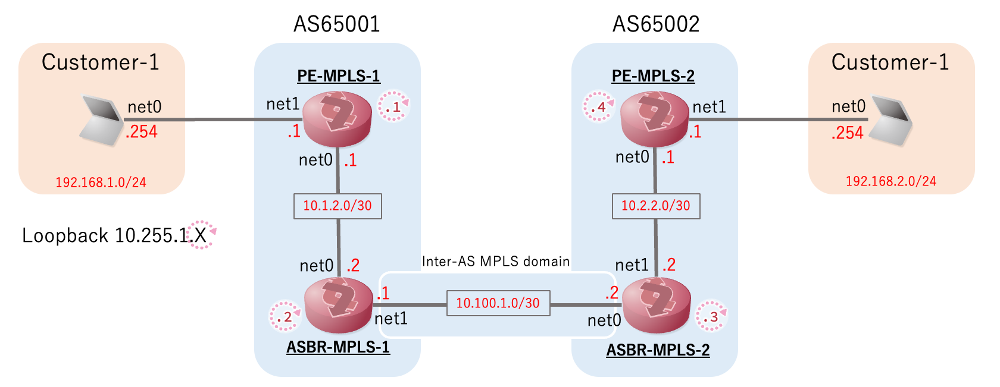

# mpls-mpls: L3VPN(VPNv4) Inter-AS Option-B w/SR-MPLS
## topology


## setup
```
$ tinet upconf -c mpls-mpls/spec.yaml | sudo sh -x
```

# mpls-srv6: L3VPN(VPNv4) Inter-AS Option-B w/SR-MPLS SRv6 Interworking 

