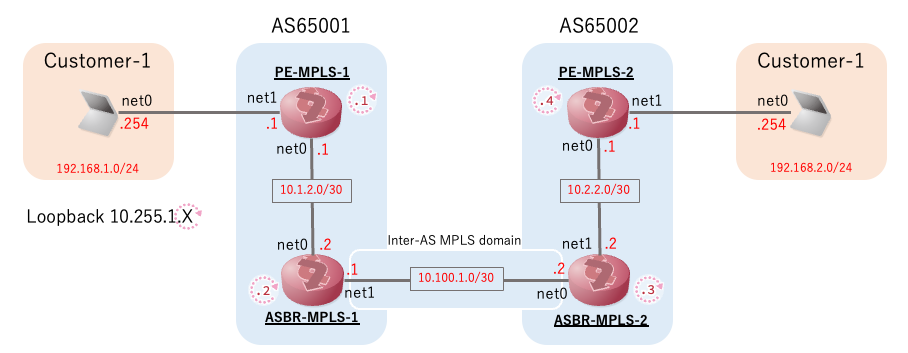
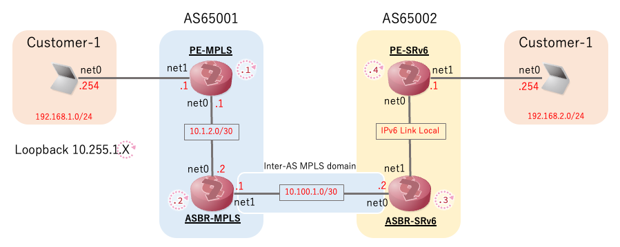

# mpls-mpls: L3VPN(VPNv4) Inter-AS Option-B w/SR-MPLS
## topology


## setup
```
$ tinet upconf -c mpls-mpls/spec.yaml | sudo sh -x
```

# mpls-srv6: L3VPN(VPNv4) Inter-AS Option-B w/SR-MPLS SRv6 Interworking 
## topology


## setup
- FRRへの追加実装前（```iproute2```で直接データプレーンを設定）
```
$ tinet upconf -c mpls-srv6/spec1.yaml | sudo sh -x
```

- FRRへの追加実装後（```neighbor <A.B.C.D|X:X::X:X|WORD> seg6-mpls-label-switching```を追加）
```
$ tinet upconf -c mpls-srv6/spec2.yaml | sudo sh -x
```
